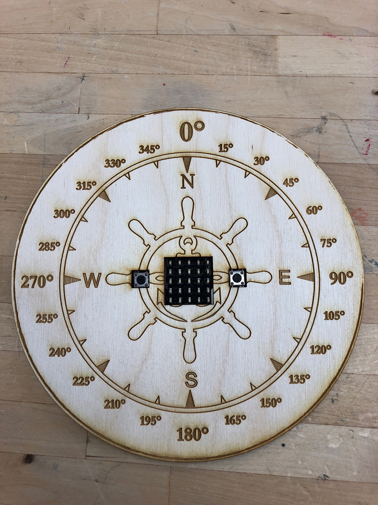

# Microbit Compass Exercise

This demonstration of the micro:bit compass uses a laser-cut wooden compass rose to show degrees and cardinal directions.

Students can use the compass rose to help translate heading information from the micro:bit's onboard compass/magnetometer into cardinal directions using MakeCode or MicroPython. The sample programs provided turn the micro:bit LED array into a digital compass needle.

With this project, students will learn how to:
* determine the orientation of the micro:bit in real space using the onboard compass/magnetometer
* use the micro:bit LED array to show directional arrow or clock images
* translate degree headings to cardinal directions
* use a laser cutter/engraver

Extension ideas:
* create a treasure or scavenger hunt
* compare the digital compass to an analog compass for accuracy
* calculate the distance to a fixed point using readings from known points and trigonometry
* make a sundial using the micro:bit to orient it to the right direction

Compass source code from [micro:bit site](http://microbit-micropython.readthedocs.io/en/latest/tutorials/direction.html)

Compass rose adapted from [Handaxe_Maker's micro:bit compass](https://www.thingiverse.com/thing:2621163).

Note: micro:bit compass by Handaxe_Maker is licensed under the [Creative Commons - Attribution license](http://creativecommons.org/licenses/by/3.0/).

